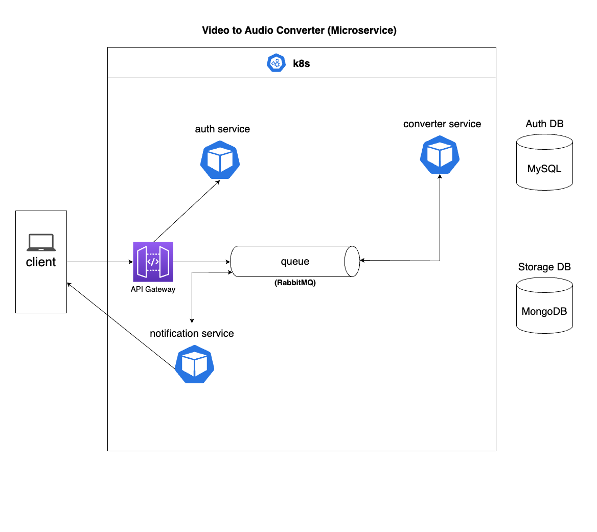

# converter-microservices
This microservices convert video(mp4) file to audio(mp3) file. It consists of the following services:

- auth service
- converter service
- api gateway
- notification service

`RABBITMQ` is used as the message broker to communicate within the services.

Here is an overview of the microservices architecture:

